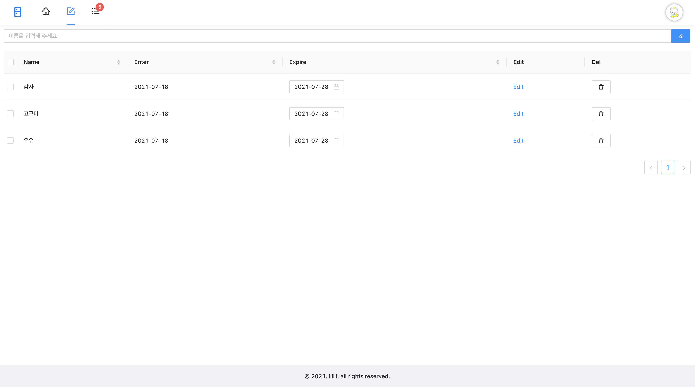
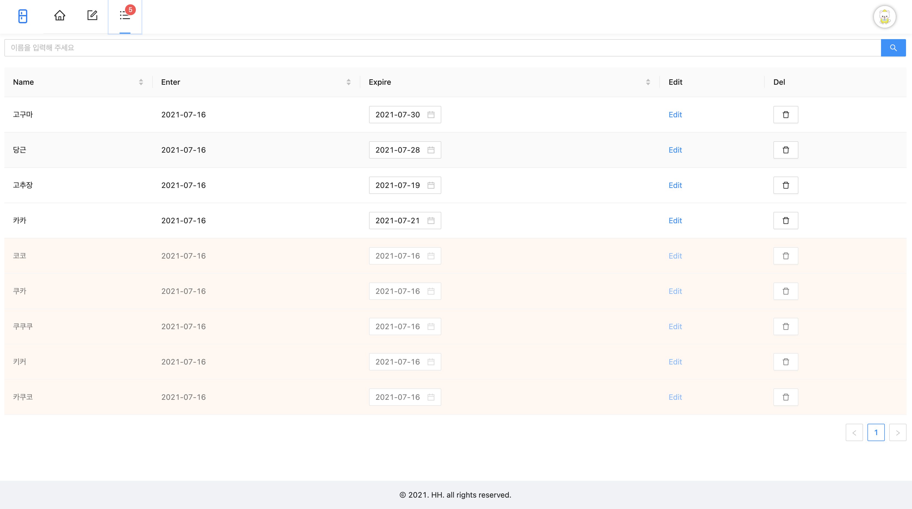

# 냉장고 품목 확인 사이트

## 데모
https://refrigerators-alert.web.app/

## 프로젝트 구성안내
### 목표
- 집에서 냉장고 관리가 제대로 되지않아 버리게 되는 음식물들이 많아지고 있다...  
  냉장고 관리를 할 수 있는 웹 어플케이션을 만들어 냉장고 관리를 해보자!
### 간단한 기술스택
- react, redux
- redux-thunk (리덕스 미들웨어, 외부 통)
- dotenv (환경변수 관리)
- firebase (데이터베이스 및 배포)
- react-uuid (제품 고유의 키값 생성하기 위해 사용)
- antd (UI/UX 프레임워크)

## 폴더 트리 구조
```text
├── public
│   └── index.html
├── src
│   ├── constants
│   │   ├── ConstantsPath.js
│   │   └── ContantCss.js
│   ├── index.js
│   ├── lib
│   │   └── firebase.js
│   ├── redux
│   │   ├── addList
│   │   │   ├── productActions.js
│   │   │   └── productSlice.js
│   │   ├── app
│   │   │   ├── appActions.js
│   │   │   └── appSlice.js
│   │   ├── itemList
│   │   │   ├── itemListActions.js
│   │   │   └── itemListSlice.js
│   │   └── store.js
│   ├── styles
│   │   └── antd-custom.scss
│   └── view
│       ├── App.js
│       ├── components
│       │   ├── AddList
│       │   ├── BreadCrumb
│       │   │   └── BreadCrumb.js
│       │   ├── Footer
│       │   │   └── FooterBox.js
│       │   └── Header
│       │       └── HeaderBox.js
│       ├── containers
│       │   ├── AddList
│       │   │   └── AddListContainer.js
│       │   └── ItemList
│       │       └── ItemListContainer.js
│       ├── pages
│       │   ├── AddList.js
│       │   ├── Home.js
│       │   ├── ItemList.js
│       │   └── NotFound.js
│       └── routes
│           └── Routes.js
└── yarn.lock
```
- 기본적으로 container에서 props를 가져오고 component로 전달하는식으로 만들었다.
- 서버와 통신하는 부분은 redux-thunk를 통해 state를 업데이트 하는 방식으로 만들었다.
## 프로젝트 설치방법
```sh
# 프로젝트 설치
yarn
```
## 프로젝트 사용법
```sh
# 프로젝트 실행
yarn start
```
## 프로젝트 기능설명
냉장고 유통기한 관리하기 위한 웹 어플리케이션 입니다.

### 제품 추가 페이지

- 냉장고 안에 들어있는 제품을 추가하는 페이지 입니다.
- 제품을 추가했을때 기본적으로 현재날짜 와 현재날짜 + 10일로 유통기한이 설정됩니다.
- 체크박스에 체크를 하면 현재 페이지에있는 제품이 리스트페이지로 이동됩니다.
- 유통기한 수정은 Expire부분 캘린더를 통해 수정이 가능합니다
- 제품이름을 변경할 때는 Edit버튼을 통해 수정이 가능합니다.
- Delete버튼을 통해 제품삭제 가능합니다.

### 제품 리스트 페이지

- 현재 냉장고 안에 있는 제품리스트 페이지 입니다.
- 상단 헤더에 배찌에 있는 숫자는 유통기한이 지난 제품에 숫자 입니다.
- 유통기한이 지난 제품들은 색상으로 바로 확인이 가능합니다.
- 유통기한 지난제품도 유통기한날짜 변경이 가능합니다
- Edit, Delete 기능은 제품 추가페이지와 동일합니다.

## 프로젝트 만들면서..
https://bereal1995.github.io/sideproject/refiregerators-alert/

### 구글 로그인
```javascript
auth.setPersistence(firebase.auth.Auth.Persistence.LOCAL)
      .then(() => {
        const provider = new firebase.auth.GoogleAuthProvider();
        auth.onAuthStateChanged((user) => {
          if (user) {
            dispatch(actionsApp.appLogin(user));
          } else {
            auth.signInWithPopup(provider)
          }
        })
      })
      .catch(err => console.log('err',err))
```
- 기존에 session으로 저장했었지만 현재 세션이나 탭에서 유지되다보니 다시 로그인 하는게 불편하여 local에 저장하는 방식으로 수정했습니다.

### 리얼타임 데이터베이스
```javascript
const action = {
  create: payload => (dispatch) => {
    // 해당 데이터 위치의 참조에 데이터 추가
    fireDatabase.ref([dataUrl]).push([payload.datas])
  },
  read: userUid => (dispatch) => {
    fireDatabase.ref([dataUrl]).on('value', data => {
      // 데이터 변화가 생기면 전달받은 데이터값으로 액션을 보내 스토어에 저장
      dispatch(actionsProduct.listenProduct(data.val()));
    });
  },
  update: payload => (dispatch) => {
    // 해당 데이터 위치의 참조에 데이터 수정
    fireDatabase.ref([dataUrl]).set([payload.datas]);
  },
  delete: payload => (dispatch) => {
    // 해당 데이터 위치의 참조에 데이터 삭제
    fireDatabase.ref([dataUrl]).remove();
  }
}
```
- 기본적으로 위에 형식으로 CRUD를 구현하였습니다.
- read함수로 데이터 변화를 감지하여 데이터를 최산화 하고
- create, update, delete를 이용하여 데이터를 수정했습니다.

## 저작권 및 사용자 정보
© 2021 HH gygud98@gmail.com


## 프로그램 작성자 및 도움을 준 사람
- https://github.com/bereal1995
- https://github.com/ovdncids


## 버전
### 1.0.0 (2021. 07. 18)
- 첫번째 출시